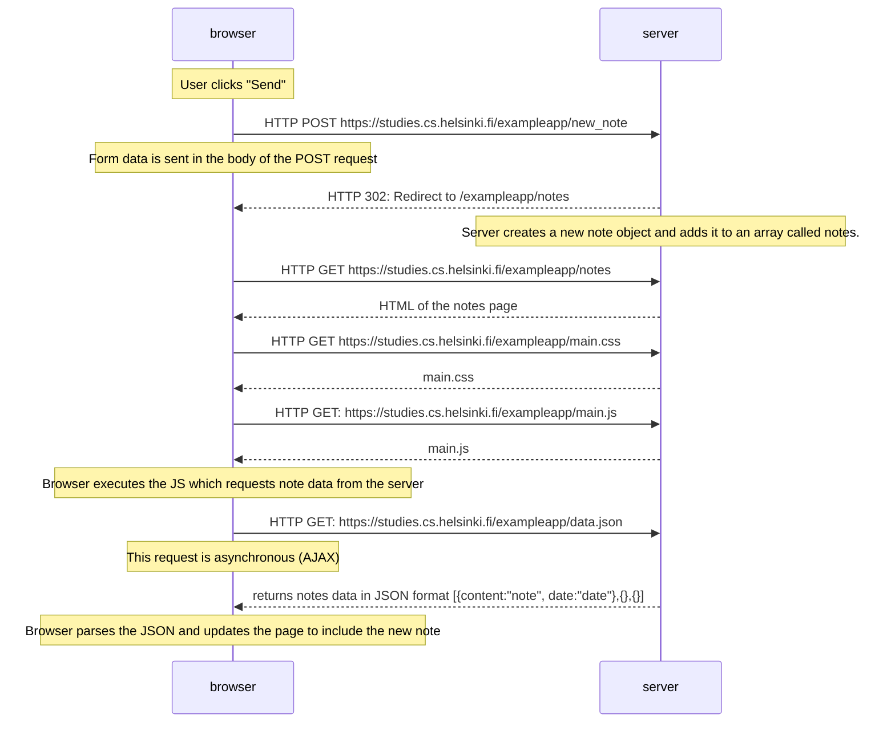

```mermaid
sequenceDiagram
    participant browser
    participant server

    Note over browser: User clicks "Send"
    browser->>server: HTTP POST https://studies.cs.helsinki.fi/exampleapp/new_note
    Note over browser: Form data is sent in the body of the POST request
    server-->>browser: HTTP 302: Redirect to /exampleapp/notes
    Note over server: Server creates a new note object and adds it to an array called notes.
    browser->>server: HTTP GET https://studies.cs.helsinki.fi/exampleapp/notes
    server-->>browser: HTML of the notes page
    browser->>server: HTTP GET https://studies.cs.helsinki.fi/exampleapp/main.css
    server-->>browser: main.css
    browser->>server: HTTP GET: https://studies.cs.helsinki.fi/exampleapp/main.js
    server-->>browser: main.js
    Note over browser: Browser executes the JS which requests note data from the server
    browser->>server: HTTP GET: https://studies.cs.helsinki.fi/exampleapp/data.json
    Note over browser: This request is asynchronous (AJAX)
    server-->>browser: returns notes data in JSON format [{content:"note", date:"date"},{},{}]
    Note over browser: Browser parses the JSON and updates the page to include the new note
```
