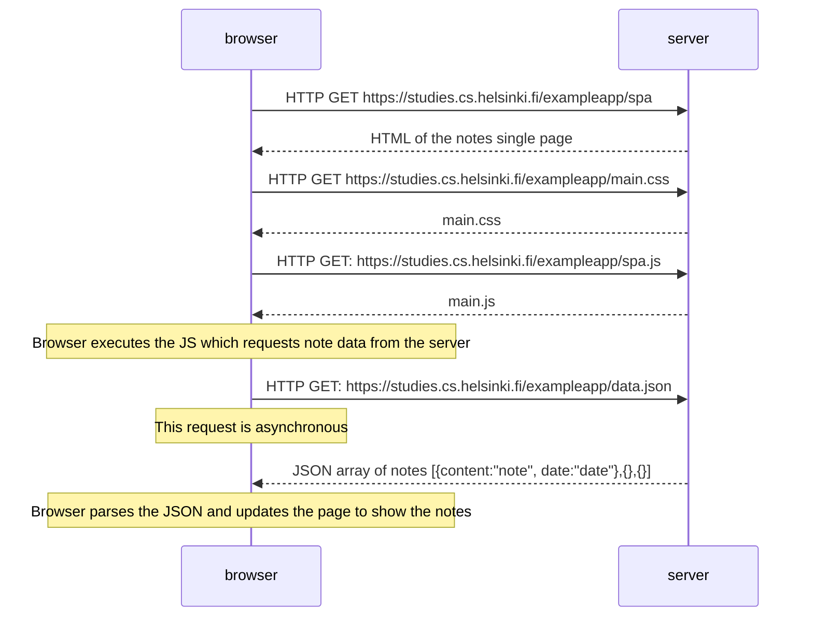

```mermaid
sequenceDiagram
    participant browser
    participant server

    browser->>server: HTTP GET https://studies.cs.helsinki.fi/exampleapp/spa
    server-->>browser: HTML of the notes single page
    browser->>server: HTTP GET https://studies.cs.helsinki.fi/exampleapp/main.css
    server-->>browser: main.css
    browser->>server: HTTP GET: https://studies.cs.helsinki.fi/exampleapp/spa.js
    server-->>browser: main.js
    Note over browser: Browser executes the JS which requests note data from the server
    browser->>server: HTTP GET: https://studies.cs.helsinki.fi/exampleapp/data.json
    Note over browser: This request is asynchronous
    server-->>browser: JSON array of notes [{content:"note", date:"date"},{},{}]
    Note over browser: Browser parses the JSON and updates the page to show the notes
```
