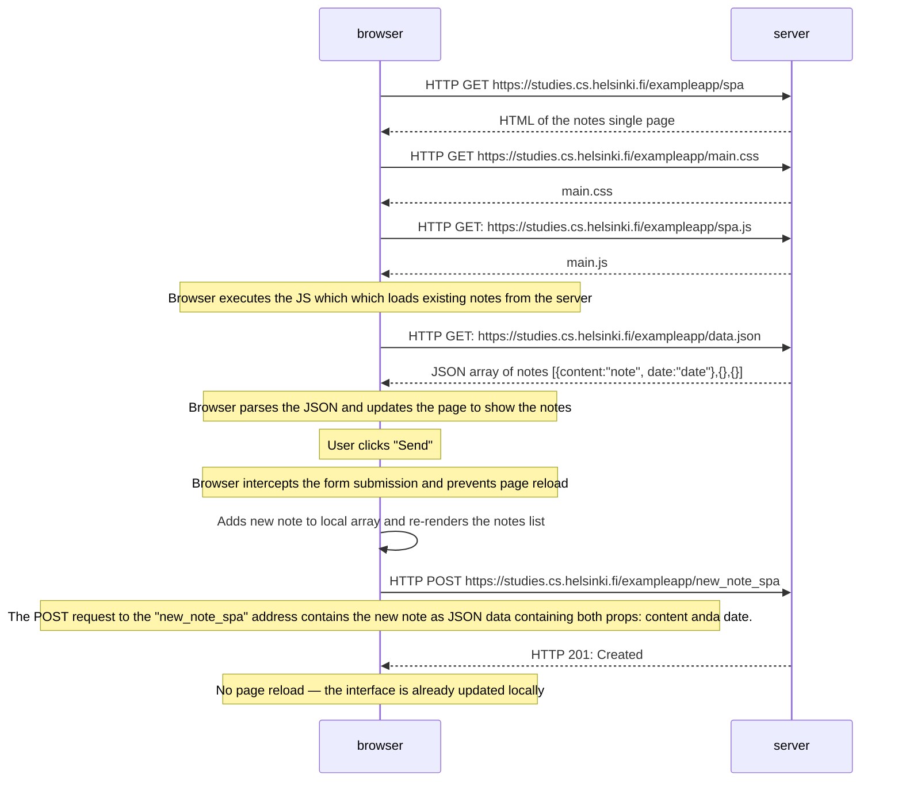

```mermaid
sequenceDiagram
    participant browser
    participant server

    browser->>server: HTTP GET https://studies.cs.helsinki.fi/exampleapp/spa
    server-->>browser: HTML of the notes single page

    browser->>server: HTTP GET https://studies.cs.helsinki.fi/exampleapp/main.css
    server-->>browser: main.css

    browser->>server: HTTP GET: https://studies.cs.helsinki.fi/exampleapp/spa.js
    server-->>browser: main.js
    Note over browser: Browser executes the JS which which loads existing notes from the server

    browser->>server: HTTP GET: https://studies.cs.helsinki.fi/exampleapp/data.json
    server-->>browser: JSON array of notes [{content:"note", date:"date"},{},{}]

    Note over browser: Browser parses the JSON and updates the page to show the notes

    Note over browser: User clicks "Send"
    Note over browser: Browser intercepts the form submission and prevents page reload
    browser->>browser: Adds new note to local array and re-renders the notes list

    browser->>server: HTTP POST https://studies.cs.helsinki.fi/exampleapp/new_note_spa
    Note over browser: The POST request to the "new_note_spa" address contains the new note as JSON data containing both props: content anda date.
    server-->>browser: HTTP 201: Created
    Note over browser: No page reload — the interface is already updated locally
```
